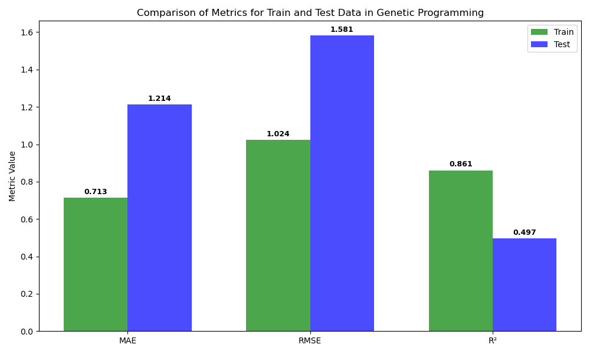

This is my masters thesis project: Data-driven Prediction of Chromium Recovery in FerroChrome Production using Genetic Programming. 
Regression models like Ridge, Lasso, Random-Forest regression model is re-trained after applying genetic programming; 10-20% perfomance improvement observed on each models.
Feature importance and sensitivity analysis is done.

